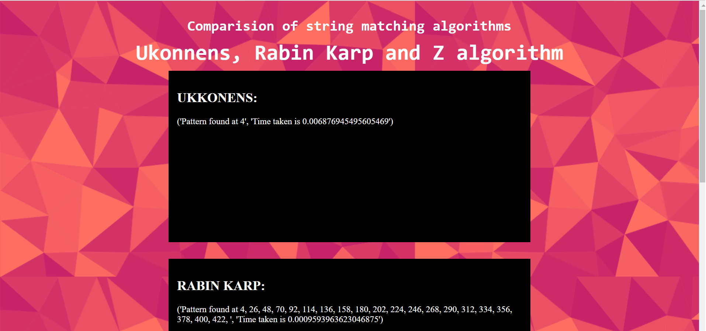
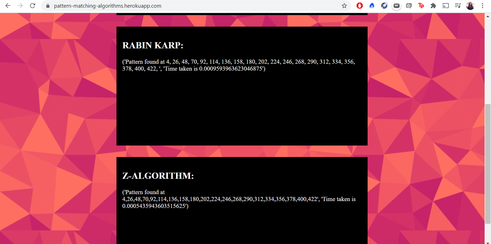
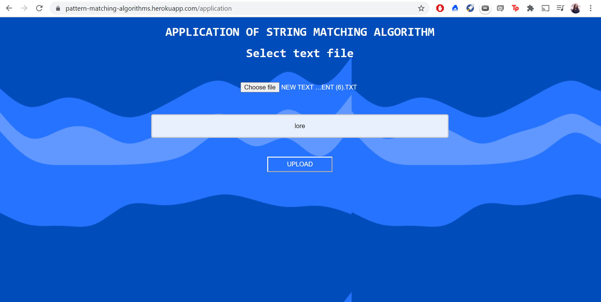
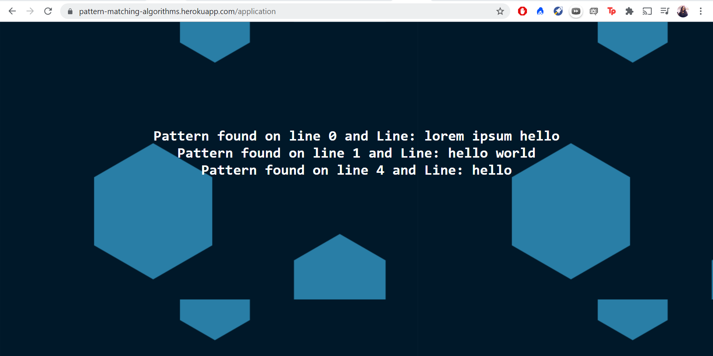

# String-matching-algorithms
## Description 
Implementation of string matching algorithms- Rabin Karp, Ukkonen and Z-algorithm and application of Z-algorithm for a grep clone, to find patterns in file. The entire code is written in Python, along with Flask used for backend. 

## Pages Preview

## To visit the site: 
[https://pattern-matching-algorithms.herokuapp.com/](https://pattern-matching-algorithms.herokuapp.com/)

## Setup
- Fork and clone the repo
- Run python main.py after all requirements are installed
